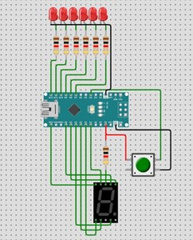

# Digital Dice

This project is a **Digital Dice** implemented using an Arduino Nano microcontroller (ATmega328P). The device simulates the rolling of a six-sided dice and displays the result on a seven-segment display. Additionally, LEDs light up corresponding to the rolled number.

## Table of Contents

- [Introduction](#introduction)
- [Components](#components)
- [Circuit Diagram](#circuit-diagram)
- [How It Works](#how-it-works)
- [Code Explanation](#code-explanation)
- [Setup Instructions](#setup-instructions)
- [Output](#output)

## Introduction

The **Digital Dice** project is designed to simulate a dice roll by generating a random number between 1 and 6. This number is displayed on a common anode seven-segment display, and corresponding LEDs blink to visually represent the number.

## Components

The project uses the following components:

- **Arduino Nano (ATmega328P)**: Microcontroller to generate random numbers and control the display and LEDs.
- **Seven-Segment Display (Common Anode)**: Displays the rolled number.
- **Switch**: Initiates the random number generation.
- **9V Power Supply**: Powers the circuit.
- **Resistors (100 ohm)**: Protect the LEDs and display.
- **Jumper Wires**: Connect components together.
- **LEDs**: Indicate the rolled number.

## Circuit Diagram

## How It Works

When the user presses the switch, the Arduino Nano generates a random number between 1 and 6 using the `random()` function. This number is then displayed on the seven-segment display. Additionally, LEDs corresponding to the rolled number light up, enhancing the visual feedback.

## Code Explanation

The code defines the pins connected to the seven-segment display and the LEDs. The random number generator is seeded with the analog value read from an unused pin to ensure randomness. The main loop continuously checks if the switch is pressed. Upon pressing, a random number is generated and displayed, while the corresponding LEDs are turned on.

### Example Code Snippet
void loop() {
  int randomNumber = random(1, 7);
  if (digitalRead(input) == HIGH) {
    switch (randomNumber) {
      case 1: 
        // Code to display '1' and turn on LED1
        break;
      // Cases 2-6 for other numbers
    }
  }
} 
## Setup Instructions

### Connect the Components:

1. Connect the seven-segment display to the Arduino Nano's digital pins A0 to A5 and pin 13 for segments A to G respectively.
2. Connect the LEDs to digital pins 7 to 12 on the Arduino Nano.
3. Attach the switch to digital pin 4 on the Arduino Nano.
4. Use resistors (100 ohm) to connect the LEDs and seven-segment display to the Arduino to prevent damage from excessive current.
5. Ensure all components are properly grounded to the Arduino's ground pin.
6. Power the Arduino Nano using a 9V battery or appropriate power supply.

### Upload the Code:

1. Open the Arduino IDE.
2. Connect the Arduino Nano to your computer via the USB cable.
3. Load the provided code into the Arduino IDE.
4. Select the appropriate board and port from the tools menu.
5. Upload the code to the Arduino Nano.

### Test the Circuit:

1. Once the code is uploaded and the circuit is powered, press the switch to simulate a dice roll.
2. The number will display on the seven-segment display, and the corresponding LEDs will light up.

## Output

- **Dice Roll Simulation**: When you press the switch, a random number between 1 and 6 is generated and displayed on the seven-segment display.
- **LED Indicator**: The LEDs corresponding to the rolled number will light up, providing a visual indication of the result.
